# FoodCal

A lightweight web app to quickly estimate calories from South Indian foods using
either a **text description** ("2 idlis", "1 masala dosa") or a **food photo**.
Users sign in with email + password (**Supabase Auth**); each account stores its
own OpenAI API key, chosen model, and daily log in **Supabase** (Postgres),
isolated by row-level security.

> 🔗 Live app: <https://foodcal.vercel.app> · 🛠 Building on it? Jump to
> [**For developers**](#for-developers).

## Features

- Text input → food name, serving size, calories, confidence, notes
- Food photo → vision-based estimate, via **image upload** or **live in-app camera
  capture** (JPG / PNG / WEBP, max 10 MB, with preview)
- **Adjustable servings** on a result — scale calories and the full nutrition
  breakdown up or down before adding it to the log
- Add results to a daily log and remove items
- **Day-by-day history** — browse previous days with per-day calorie totals and
  nutrition; clear an individual day
- **Export** your full log as **CSV** or **JSON**
- Set a daily calorie goal and see today's remaining (or over) count down as you log
- Automatic total calories, persisted across refreshes
- **Installable PWA** — add to a phone home screen for a standalone, full-screen
  app with its own icon
- Mobile responsive, clean UI, friendly error handling

## Screenshots

A visual tour of FoodCal. Full set, viewports, and capture notes live in
[`docs/screenshots-index.md`](docs/screenshots-index.md).

### Gallery

<table>
  <tr>
    <td align="center"><a href="docs/screenshots/desktop/plan-overview.png">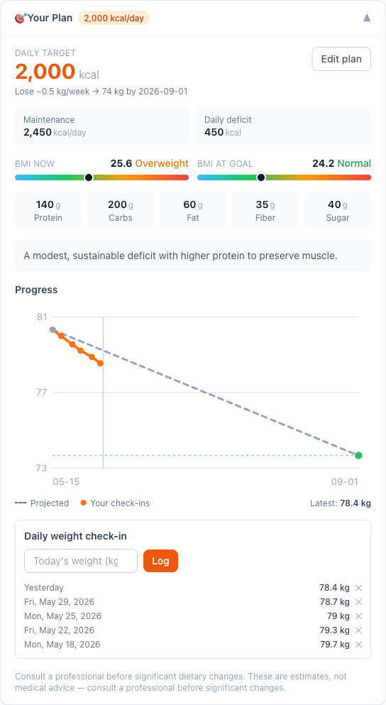</a></td>
    <td align="center"><a href="docs/screenshots/desktop/calorie-log.png">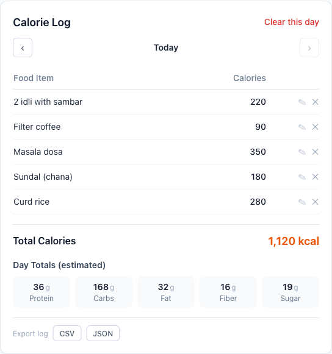</a></td>
    <td align="center"><a href="docs/screenshots/desktop/meal-photo-upload.png">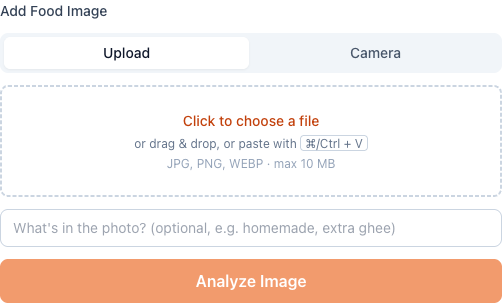</a></td>
  </tr>
  <tr>
    <td align="center"><a href="docs/screenshots/desktop/fasting-timer.png">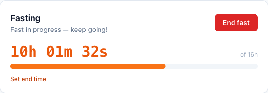</a></td>
    <td align="center"><a href="docs/screenshots/desktop/ai-suggestions.png"></a></td>
    <td align="center"><a href="docs/screenshots/desktop/weight-progress-chart.png">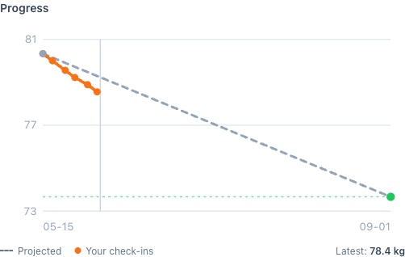</a></td>
  </tr>
</table>

### Feature screenshots

Desktop views — click any thumbnail for the full image.

| Feature | Preview | What it shows |
| --- | --- | --- |
| **Sign in** | <a href="docs/screenshots/desktop/onboarding-signin.png">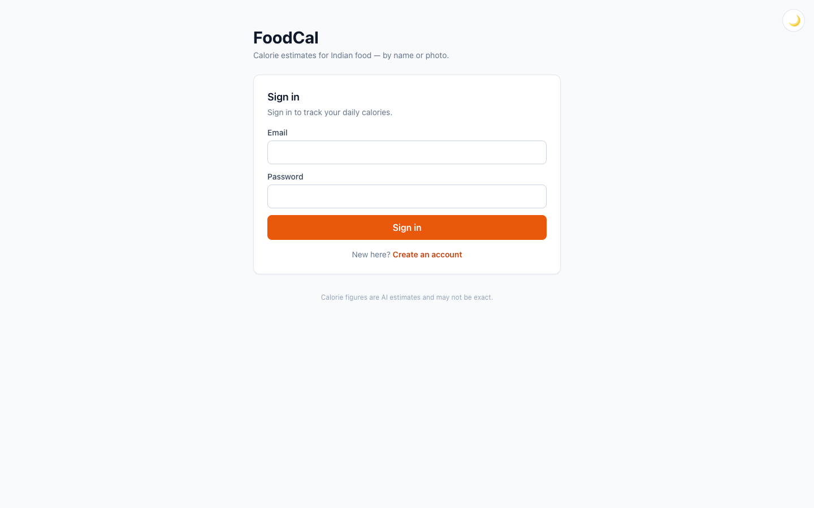</a> | Email + password sign-in (single-user "private deployment" notice). |
| **Settings (BYOK)** | <a href="docs/screenshots/desktop/settings-popover.png">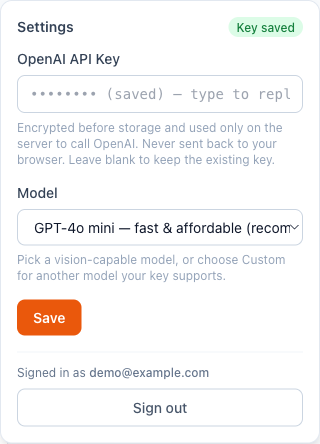</a> | Encrypted OpenAI key + model picker; the key is never returned to the browser. |
| **Your plan** | <a href="docs/screenshots/desktop/plan-overview.png"></a> | Daily target, maintenance/deficit, BMI now & at goal, macro targets. |
| **Weight progress** | <a href="docs/screenshots/desktop/weight-progress-chart.png"></a> | Projected path vs. actual check-ins with a "today" marker. |
| **Weight check-in** | <a href="docs/screenshots/desktop/weight-checkin.png">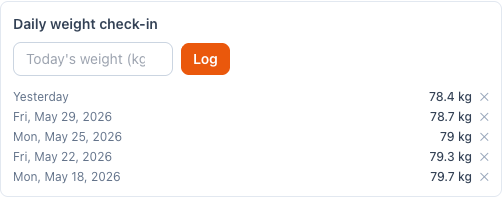</a> | Log today's weight; recent history with quick removal. |
| **Log by text** | <a href="docs/screenshots/desktop/calorie-text-input.png">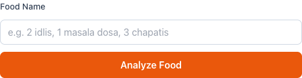</a> | Type "2 idlis, 1 masala dosa" for an instant estimate. |
| **Add manually** | <a href="docs/screenshots/desktop/calorie-manual-entry.png">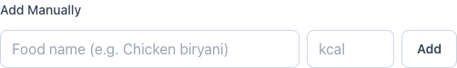</a> | Enter a name + calories directly, no AI call. |
| **Daily goal** | <a href="docs/screenshots/desktop/calorie-daily-goal.png">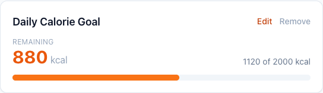</a> | Remaining (or over) countdown with a progress bar. |
| **Calorie log** | <a href="docs/screenshots/desktop/calorie-log.png"></a> | Day navigator, totals, macro breakdown, CSV/JSON export. |
| **Photo upload** | <a href="docs/screenshots/desktop/meal-photo-upload.png"></a> | Drag, drop, or paste a food photo to estimate calories. |
| **Live camera** | <a href="docs/screenshots/desktop/meal-photo-camera.png">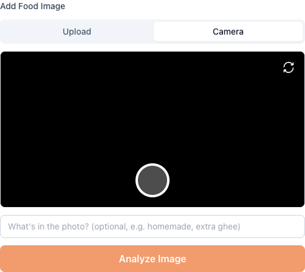</a> | Snap a plate in-app (shutter + flip camera). |
| **Fasting** | <a href="docs/screenshots/desktop/fasting-timer.png"></a> | Pick a window (16:8, OMAD…); live timer + progress bar. |
| **Food suggestions** | <a href="docs/screenshots/desktop/ai-suggestions.png"></a> | "What should I eat?" tuned to your remaining budget. |
| **Ask the coach** | <a href="docs/screenshots/desktop/ai-coach.png">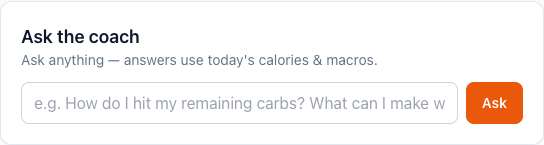</a> | Free-form Q&A grounded in today's calories & macros. |
| **Performance review** | <a href="docs/screenshots/desktop/analytics-performance.png"></a> | "How am I doing?" — weight, calorie, macro & fasting read. |
| **End the day** | <a href="docs/screenshots/desktop/analytics-endday.png"></a> | Encouraging today / week / month / goal summary. |

### Mobile

FoodCal is mobile-first. iPhone-sized captures:

<table>
  <tr>
    <td align="center">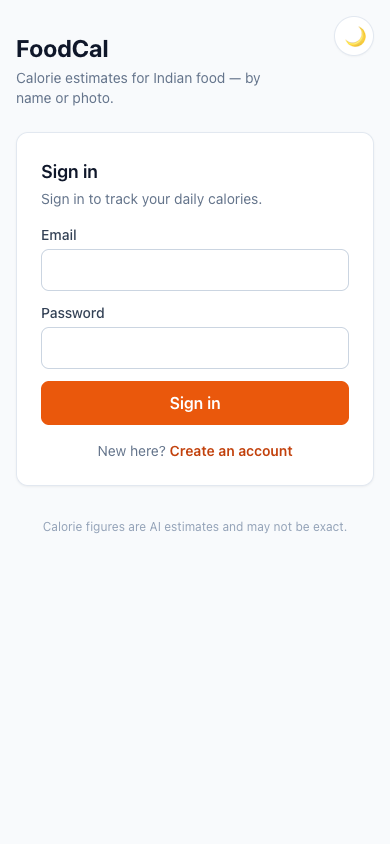<br><sub>Sign in</sub></td>
    <td align="center">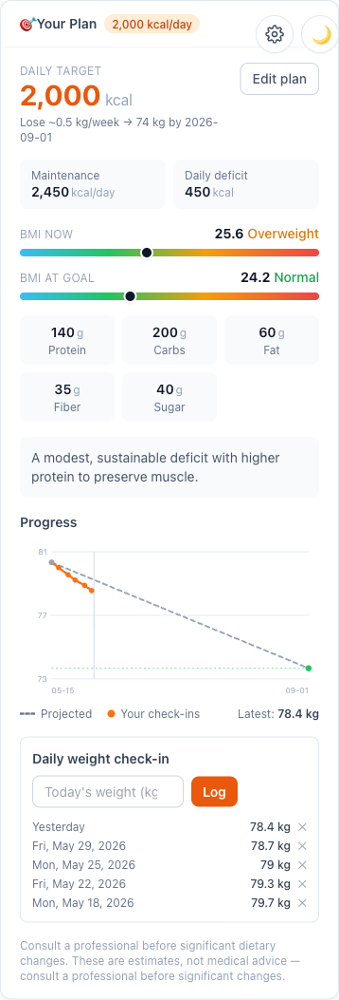<br><sub>Your plan</sub></td>
    <td align="center">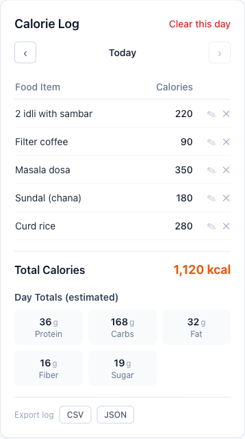<br><sub>Calorie log</sub></td>
    <td align="center">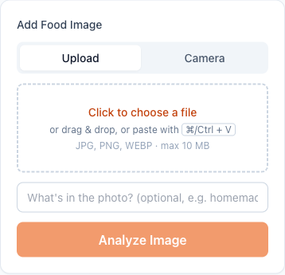<br><sub>Photo upload</sub></td>
  </tr>
  <tr>
    <td align="center">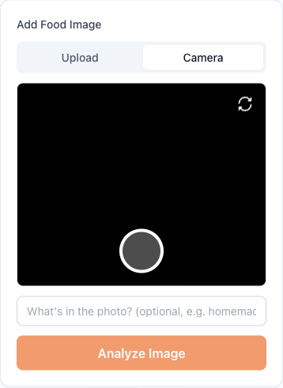<br><sub>Live camera</sub></td>
    <td align="center">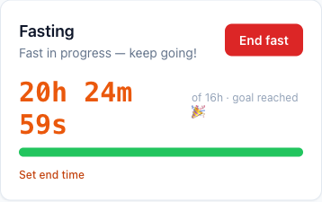<br><sub>Fasting</sub></td>
    <td align="center">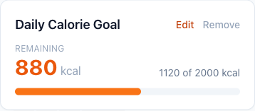<br><sub>Daily goal</sub></td>
    <td align="center">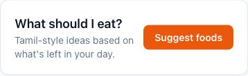<br><sub>Suggestions</sub></td>
  </tr>
  <tr>
    <td align="center">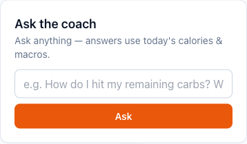<br><sub>Ask the coach</sub></td>
    <td align="center"><br><sub>Review</sub></td>
    <td align="center">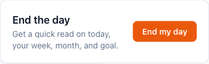<br><sub>End the day</sub></td>
    <td align="center">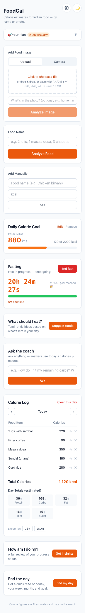<br><sub>Full app</sub></td>
  </tr>
</table>

## Demos

Short screen recordings of the core flows. They're produced with the guide in
[`docs/demos/`](docs/demos/README.md) (record → `docs/demos/make-gifs.sh`) and
render here once generated.

<table>
  <tr>
    <td align="center"><br><sub><b>Onboarding</b></sub></td>
    <td align="center"><br><sub><b>Log food by text</b></sub></td>
  </tr>
  <tr>
    <td align="center"><br><sub><b>Log food by image</b></sub></td>
    <td align="center"><br><sub><b>Fasting flow</b></sub></td>
  </tr>
  <tr>
    <td align="center"><br><sub><b>Weight check-in</b></sub></td>
    <td align="center"><br><sub><b>AI coach</b></sub></td>
  </tr>
</table>

---

# For developers

The sections below are the technical reference: how FoodCal is built, how to run
and configure it locally, and how it deploys.

## Project overview

FoodCal is a single **Next.js (App Router)** application — there is no separate
backend service. The "backend" is the set of **API route handlers** under
[`app/api/`](app/api) that run on the **Node.js runtime**. The browser uses
`supabase-js` **only for authentication**; all application data flows through the
app's own API routes, each authenticated with the user's Supabase access token
and scoped by Postgres **row-level security (RLS)**.

Core design points:
- **Single page, client islands.** [`app/page.tsx`](app/page.tsx) is a thin
  server component that injects runtime auth config into
  [`components/HomeClient.tsx`](components/HomeClient.tsx), which composes every
  feature panel.
- **Bring-your-own OpenAI key, encrypted at rest.** Each user stores their own
  key; it is encrypted with AES-256-GCM and only ever decrypted server-side.
- **One auth/authorization chokepoint.** `getUserClient()` in
  [`lib/supabase.ts`](lib/supabase.ts) validates the token, applies the
  single-user allowlist, and returns an RLS-scoped client used by every route.
- **Configuration-driven single-user mode** (see below) with no code changes to
  switch between single- and multi-user.
- **Framework-free logic in `lib/`**, unit-tested with Vitest.

For the full system design with diagrams, see
[**`docs/architecture.md`**](docs/architecture.md). A product-level overview is in
[`docs/PRODUCT.md`](docs/PRODUCT.md).

## Tech stack

| Layer | Choice |
| --- | --- |
| Framework | **Next.js 16** (App Router, Turbopack), **React 19** |
| Language | **TypeScript** (strict) |
| Styling | **Tailwind CSS 3** |
| Auth & DB | **Supabase** — Auth (email/password) + Postgres with RLS |
| AI | **OpenAI API** (text + vision JSON mode), default `gpt-4o-mini`, bring-your-own-key |
| Runtime | API routes on the **Node.js runtime** (`export const runtime = "nodejs"`) — required for Node `crypto` + the OpenAI SDK |
| Tests | **Vitest** (pure `lib/` logic) |
| Hosting | **Vercel** (see [Deployment](#deployment)) |

## Architecture

A request from the browser carries the Supabase session access token as a
`Authorization: Bearer …` header. Every API route runs it through
`getUserClient()`, which (1) validates the token via Supabase Auth, (2) enforces
the single-user allowlist, and (3) returns a Supabase client scoped to that user
so **RLS** guarantees row isolation. AI routes additionally load and decrypt the
user's OpenAI key server-side before calling OpenAI in JSON mode.

```
Browser ──Bearer token──▶ /api/* route ──▶ getUserClient() ──▶ Supabase (RLS)
   │  (supabase-js: auth only)                     │
   └──────────────────────────────────────────────┴──▶ OpenAI (per-user key, server-side)
```

➡️ **Full design, data model, and per-flow sequence diagrams (auth, AI, image
upload, deployment):** [`docs/architecture.md`](docs/architecture.md).

### API routes

All routes require authentication; AI routes also require the user's saved key.

| Route (`app/api/...`) | Methods | Purpose | OpenAI |
| --- | --- | --- | :---: |
| `log/route.ts` | GET / POST / PATCH / DELETE | Daily log CRUD | – |
| `settings/route.ts` | GET / POST | Model, encrypted key, goal, plan, fasting | – |
| `weight/route.ts` | GET / POST / DELETE | Weight check-ins | – |
| `analyze-text/route.ts` | POST | Text → calorie + macro estimate | ✓ |
| `analyze-image/route.ts` | POST | Photo → estimate (vision) | ✓ |
| `plan/route.ts` | POST | Build a calorie/macro plan | ✓ |
| `insights/route.ts` | POST | "End the day" summary | ✓ |
| `suggest/route.ts` | POST | Food suggestions | ✓ |
| `ask/route.ts` | POST | Coach Q&A | ✓ |
| `performance/route.ts` | POST | Progress review | ✓ |

## Folder structure

```
.
├── app/
│   ├── api/                       # Route handlers (Node runtime) — the backend
│   │   ├── analyze-text/route.ts  #   POST  text → estimate (auth + per-user key)
│   │   ├── analyze-image/route.ts #   POST  photo → estimate (vision)
│   │   ├── ask/route.ts           #   POST  coach Q&A
│   │   ├── insights/route.ts      #   POST  "end the day" summary
│   │   ├── log/route.ts           #   GET/POST/PATCH/DELETE  daily log CRUD (RLS)
│   │   ├── performance/route.ts   #   POST  progress review
│   │   ├── plan/route.ts          #   POST  build calorie/macro plan
│   │   ├── settings/route.ts      #   GET/POST  model + encrypted key + goal/plan/fasting
│   │   ├── suggest/route.ts       #   POST  food suggestions
│   │   └── weight/route.ts        #   GET/POST/DELETE  weight check-ins
│   ├── layout.tsx                 # Root layout, theme boot script, metadata
│   ├── page.tsx                   # Server component → reads auth policy → HomeClient
│   ├── manifest.ts                # PWA manifest (served at /manifest.webmanifest)
│   ├── apple-icon.tsx, icon.svg   # App icons
│   └── globals.css
├── components/                    # React client components (single-page UI)
│   ├── HomeClient.tsx             # Session gating + composition of all panels
│   ├── AuthForm.tsx               # Email/password sign in (signup gated by mode)
│   ├── SettingsPanel.tsx          # BYOK key + model
│   ├── TextInputForm · ImageUploadForm · CameraCapture · ManualEntryForm
│   ├── ResultCard · NutritionBreakdown · DailyLog · LogEntryEditor · DailyGoal
│   ├── PlanPanel · PlanForm · ProgressChart · BmiBar · WeightCheckIn
│   ├── FastingTimer · FoodSuggestions · AskCoach
│   └── PerformanceReview · DayInsights · ExportButtons · ThemeToggle
├── lib/                           # Framework-free logic (unit-tested)
│   ├── authConfig.ts              # Single-user/multi-user policy (server-only)
│   ├── supabase.ts                # Server: token-auth'd RLS client + allowlist gate
│   ├── supabaseBrowser.ts         # Browser: auth/session client + access token
│   ├── api.ts                     # Client fetch helpers (attach Bearer token)
│   ├── openai.ts, userOpenAI.ts   # OpenAI client/prompts/parsing; load+decrypt user key
│   ├── crypto.ts                  # AES-256-GCM encrypt/decrypt
│   ├── imageType.ts               # Magic-byte image sniffing
│   ├── plan · fasting · insights · suggest · performance · ask
│   ├── nutrition · scale · health · dates · export · download
│   ├── settings.ts, types.ts
│   └── *.test.ts                  # Vitest unit tests for the pure logic
├── docs/
│   ├── architecture.md            # System design + Mermaid diagrams
│   ├── PRODUCT.md                 # Product overview
│   ├── screenshots-index.md, screenshots/   # Captured screenshots (desktop/ + mobile/)
│   └── demos/                     # Demo recording guide + GIF pipeline
├── next.config.mjs                # Baseline security headers
├── tailwind.config.ts, postcss.config.js, tsconfig.json, vitest.config.ts
├── .env.local.example
└── package.json
```

## Local setup

### Prerequisites
- **Node.js 20.9+** (required by Next.js 16) and npm.
- A **Supabase** project (free tier is fine).
- An **OpenAI API key** — entered per user in the app's Settings, not via env.

### Install

```bash
npm install
```

### Configure environment

```bash
cp .env.local.example .env.local   # then fill in the values (see below)
```

### Database

In the Supabase **SQL editor**, apply the schema (Auth is enabled by default on
every project):

```sql
-- Per-user settings: encrypted OpenAI key + chosen model.
create table public.user_settings (
  user_id uuid primary key references auth.users (id) on delete cascade,
  openai_key_cipher text,
  model text not null default 'gpt-4o-mini',
  daily_calorie_goal integer,
  updated_at timestamptz not null default now()
);
alter table public.user_settings enable row level security;
create policy "own settings - select" on public.user_settings for select to authenticated using (auth.uid() = user_id);
create policy "own settings - insert" on public.user_settings for insert to authenticated with check (auth.uid() = user_id);
create policy "own settings - update" on public.user_settings for update to authenticated using (auth.uid() = user_id) with check (auth.uid() = user_id);

-- Daily log, scoped to the authenticated user.
create table public.log_entries (
  id uuid primary key default gen_random_uuid(),
  user_id uuid not null references auth.users (id) on delete cascade,
  food_name text not null,
  calories integer not null default 0,
  nutrition jsonb,
  created_at timestamptz not null default now()
);
create index log_entries_user_created_idx on public.log_entries (user_id, created_at desc);
alter table public.log_entries enable row level security;
create policy "own log - select" on public.log_entries for select to authenticated using (auth.uid() = user_id);
create policy "own log - insert" on public.log_entries for insert to authenticated with check (auth.uid() = user_id);
create policy "own log - delete" on public.log_entries for delete to authenticated using (auth.uid() = user_id);

-- Auto-confirm new accounts (so email/password works without SMTP).
-- Remove this and enable "Confirm email" once you wire up email delivery.
create or replace function public.auto_confirm_email()
returns trigger language plpgsql security definer set search_path = '' as $$
begin
  if new.email_confirmed_at is null then new.email_confirmed_at := now(); end if;
  return new;
end; $$;
revoke execute on function public.auto_confirm_email() from public, anon, authenticated;
create trigger auto_confirm_email_trigger before insert on auth.users
  for each row execute function public.auto_confirm_email();
```

> The repo does not include a `supabase/migrations/` directory — the schema above
> is the source of truth. Newer deployments also add `weight_entries`, plus
> `plan` and `fasting` JSONB columns on `user_settings`; see
> [`docs/architecture.md` §4](docs/architecture.md#4-database-schema-overview)
> for the complete data model.

### Run & test

```bash
npm run dev      # http://localhost:3000
npm run build    # production build
npm start        # serve the production build
npm test         # Vitest (run once)
npm run test:watch
```

## Environment variables

All variables are read server-side except the two `NEXT_PUBLIC_*` Supabase
values (which are safe to expose to the browser).

| Variable | Required | Description |
| --- | --- | --- |
| `NEXT_PUBLIC_SUPABASE_URL` | ✅ | Supabase project URL (Project Settings → API). |
| `NEXT_PUBLIC_SUPABASE_ANON_KEY` | ✅ | Supabase publishable/anon key (safe in the browser). |
| `SETTINGS_ENC_KEY` | ✅ | 32-byte, base64-encoded secret used to encrypt each user's OpenAI key (AES-256-GCM). Generate: `node -e "console.log(require('crypto').randomBytes(32).toString('base64'))"`. |
| `SINGLE_USER_MODE` | – | `true` locks the app to `ALLOWED_EMAIL`. Default `false` (multi-user). See [Single-user mode](#single-user-mode). |
| `ALLOWED_EMAIL` | – (required if single-user) | Allowed email; a comma-separated allowlist is also accepted. |
| `OPENAI_API_KEY` | – | Optional **server-side fallback** key. Supported in code ([`lib/openai.ts`](lib/openai.ts)) but the documented model is per-user BYOK, so it is normally unset. |
| `OPENAI_MODEL` | – | Optional fallback model when a user hasn't chosen one. |

There is **no required** `OPENAI_API_KEY` — each user enters their own key in the
app's Settings after signing in (encrypted and stored server-side, never
returned to the browser).

## Deployment

Hosting is **Vercel** (the repo contains `.vercel/project.json`; there is no
`vercel.json`, so build settings rely on Next.js auto-detection).

1. Push this repo to GitHub (or GitLab/Bitbucket).
2. Go to <https://vercel.com/new> and import the repository.
3. In **Project Settings → Environment Variables**, add the three required vars:
   `NEXT_PUBLIC_SUPABASE_URL`, `NEXT_PUBLIC_SUPABASE_ANON_KEY`, `SETTINGS_ENC_KEY`.
   To run as a private, single-user deployment, also add `SINGLE_USER_MODE=true`
   and `ALLOWED_EMAIL=you@example.com` — changes take effect on the next deploy.
4. Click **Deploy**. Vercel auto-detects Next.js — no extra config needed.

From the CLI instead:

```bash
npm i -g vercel
vercel --prod
```

Baseline security headers (`X-Frame-Options`, `X-Content-Type-Options`,
`Referrer-Policy`, `Permissions-Policy`, HSTS) are applied to every response in
[`next.config.mjs`](next.config.mjs).

## Authentication & security

- **Login required.** Email + password via Supabase Auth. The browser holds the
  session; every API request carries the access token as a `Bearer` header.
- **Per-user data.** `user_settings`, `log_entries`, and `weight_entries` are
  scoped by `auth.uid()` through RLS, so each user only ever sees their own rows.
  The server always acts *as the user* (no service-role key).
- **API key (BYOK) is encrypted at rest.** When you save it, the server encrypts
  it with AES-256-GCM using `SETTINGS_ENC_KEY` (a server-only secret) and stores
  only the ciphertext. It is decrypted **server-side only** when calling OpenAI
  and is **never returned to the browser** — Settings shows a "Key saved" status,
  not the key.
- **Model name** is saved per user (RLS-protected) alongside the key.
- **Upload hardening.** Uploaded images are validated by their actual magic bytes
  (not a client-supplied Content-Type) before being sent to OpenAI; JPG/PNG/WEBP
  only, 10 MB max. Images are not persisted.
- **Headers.** Baseline security headers on every response (see
  [`next.config.mjs`](next.config.mjs)); a strict CSP is intentionally omitted to
  avoid breaking the inline theme-boot script and Supabase/OpenAI connections.

> New accounts are auto-confirmed via a database trigger so email/password works
> without configuring SMTP. To require real email verification, remove the
> `auto_confirm_email` trigger and enable "Confirm email" in the Supabase
> dashboard (Authentication → Providers → Email) with SMTP configured.

## Single-user mode

The app ships as a normal multi-user product but can be locked down to a single
account (or a small allowlist) with **two server-side environment variables**.
Everything is **configuration-driven and fully reversible** — flip the flag to
switch modes; no code is added or removed to go back.

| Variable           | Effect                                                                                       |
| ------------------ | -------------------------------------------------------------------------------------------- |
| `SINGLE_USER_MODE` | `true` enables lockdown. `false` (or unset) = normal multi-user behavior. **Default: false.** |
| `ALLOWED_EMAIL`    | The email allowed to sign in while locked down. A comma-separated list is also accepted.      |

Both are **server-only** (never exposed to the browser), so no `NEXT_PUBLIC_*`
mirror is needed and the allowlist can't be tampered with client-side.

### What `SINGLE_USER_MODE=true` does

- **Hides sign-up.** The "Create an account" toggle disappears; the sign-in
  screen shows a "private deployment" note and the allowed address.
- **Disables account creation in the app.** Even if the signup path is invoked,
  it is refused.
- **Allows authentication only for `ALLOWED_EMAIL`.** Any other signed-in
  account is rejected and shown an "Access restricted" screen.
- **Enforces this server-side.** Every API route authenticates through one
  shared helper (`getUserClient` in [`lib/supabase.ts`](lib/supabase.ts)), which
  applies the allowlist from the centralized policy in
  [`lib/authConfig.ts`](lib/authConfig.ts). A request that bypasses the frontend
  (e.g. a raw `curl` with a stolen/other token) gets **`401 Unauthorized`**.
- **Fails closed.** If `SINGLE_USER_MODE=true` but `ALLOWED_EMAIL` is empty, the
  policy denies everyone rather than exposing data.

When `SINGLE_USER_MODE=false`, none of the above applies: sign-up returns
automatically and there is no email restriction (`getUserClient` behaves exactly
as it did before this feature existed).

### Switching modes

**Lock down (multi-user → single-user):**

1. Set `SINGLE_USER_MODE=true` and `ALLOWED_EMAIL=you@example.com` (locally in
   `.env.local`, or in your host's env vars — then redeploy).
2. *(Recommended, defense-in-depth)* Disable public sign-ups in Supabase — see
   below.

**Reverse (single-user → multi-user) — this is all that's required:**

1. Set `SINGLE_USER_MODE=false` (or remove it).
2. Re-enable sign-ups in Supabase **if** you disabled them in step 2 above.

That's it. No code changes, no schema changes, no data migration.

### Supabase dashboard: disabling public sign-ups (reversible)

The app's email allowlist already blocks any rogue account from reading or
writing data, so this step is **optional hardening** that stops accounts from
being *created* at the auth layer at all. It cannot be toggled from code — it's
a GoTrue auth setting — so do it in the dashboard:

- **Disable:** Supabase dashboard → **Authentication → Sign In / Providers** →
  turn **off** "Allow new users to sign up" (the project-level
  `Disable signup` switch). New sign-ups via the public anon key are now
  rejected by Supabase itself.
- **Re-enable (to return to multi-user):** the same screen → turn **on**
  "Allow new users to sign up".

This setting does **not** delete or modify any existing user or data; it only
controls whether *new* accounts may be created.

### Bootstrapping the allowed user

In single-user mode sign-up is hidden, so the allowed account must already
exist. To create it the first time, either temporarily set
`SINGLE_USER_MODE=false` (and re-enable Supabase sign-ups) to register, then
flip both back — or add the user directly in the Supabase dashboard
(**Authentication → Users → Add user**).

## Testing

Pure logic (date grouping, serving scaling, CSV/JSON export, image-type
sniffing, fasting, insights, performance, plan, suggest, health, and the
single-user policy) is unit-tested with [Vitest](https://vitest.dev):

```bash
npm test         # run once
npm run test:watch
```

Tests live next to the code as `lib/*.test.ts`. API routes and React components
are not currently unit-tested.

## Notes

- Calorie values are AI estimates and may not be exact.
- Each account's API key, model, and log are stored in Supabase under RLS; the
  key is encrypted with `SETTINGS_ENC_KEY` and never sent back to the browser.
- On Supabase's free tier, a project auto-pauses after ~7 days of inactivity;
  restore it from the dashboard if the app stops working.
