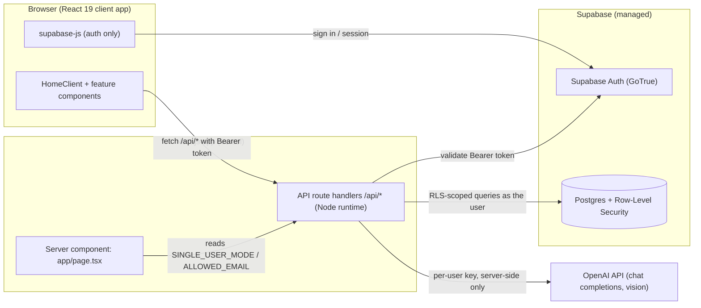
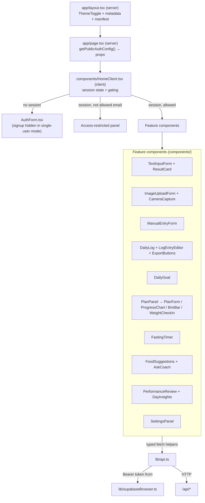
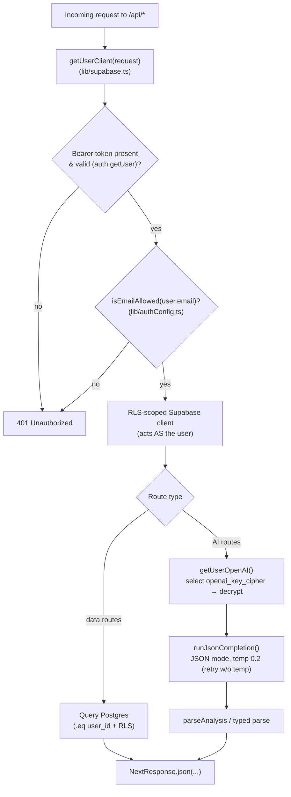
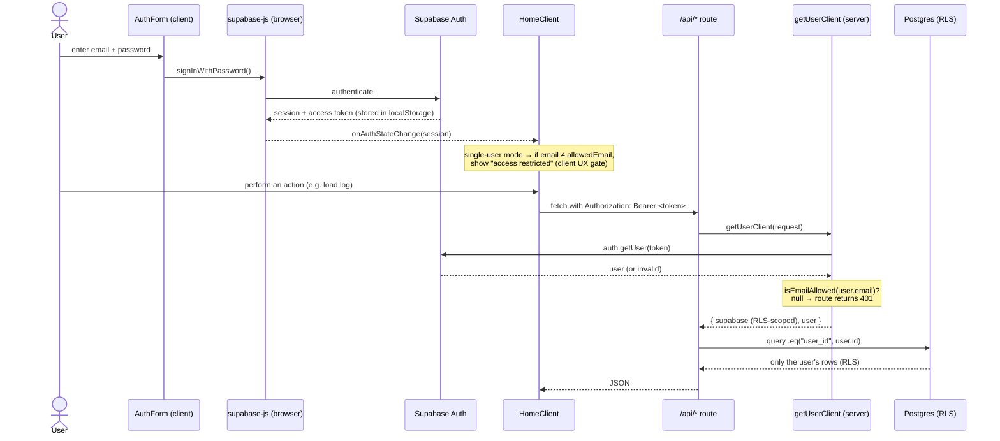
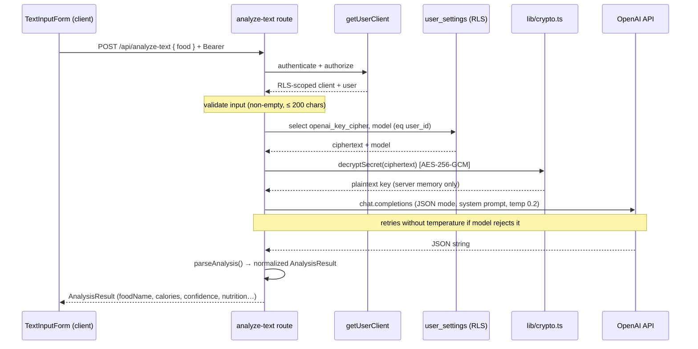
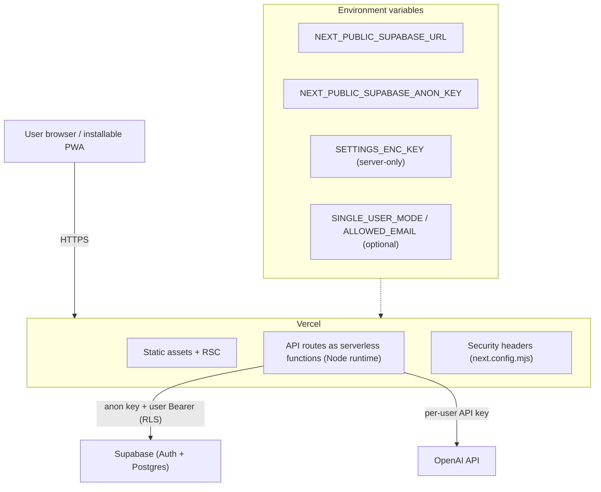

# FoodCal — Architecture

A reference for how FoodCal is structured and how data flows through it.

> **Scope & method.** This document is derived strictly from the repository
> contents as of 2026-06-01 (file references are given throughout). Where the
> repository does not contain a piece of information, it is marked **“Not in
> repo”** rather than guessed. See [§10 Gaps & unverified](#10-gaps--not-verifiable-from-the-repository).

## Contents
1. [High-level system architecture](#1-high-level-system-architecture)
2. [Frontend architecture](#2-frontend-architecture)
3. [Backend architecture](#3-backend-architecture)
4. [Database schema overview](#4-database-schema-overview)
5. [Authentication & authorization flow](#5-authentication--authorization-flow)
6. [AI integration flow](#6-ai-integration-flow)
7. [Image upload flow](#7-image-upload-flow)
8. [Deployment architecture](#8-deployment-architecture)
9. [Cross-cutting: security](#9-cross-cutting-security)
10. [Gaps & not verifiable from the repository](#10-gaps--not-verifiable-from-the-repository)

---

## 1. High-level system architecture

FoodCal is a single **Next.js 16** (App Router) application that talks to two
external managed services: **Supabase** (Auth + Postgres) and the **OpenAI API**.
There is no separate backend service — the "backend" is the set of Next.js API
route handlers under [`app/api/`](../app/api), which run on the **Node.js
runtime** (`export const runtime = "nodejs"` in each route).



**Key properties (all verified in code):**
- The browser uses `supabase-js` **only for authentication** (sign in / session /
  token / sign out) — see [`lib/supabaseBrowser.ts`](../lib/supabaseBrowser.ts).
  All application data goes through the app's own API routes.
- Every API call carries the Supabase session **access token** as a
  `Authorization: Bearer …` header ([`lib/api.ts`](../lib/api.ts)).
- The OpenAI key is **never sent to the browser**; it is decrypted and used only
  inside API routes ([`lib/userOpenAI.ts`](../lib/userOpenAI.ts),
  [`lib/crypto.ts`](../lib/crypto.ts)).

---

## 2. Frontend architecture

The UI is a **single page** rendered as a thin **server component** that injects
runtime auth config into a large **client component**. There are no client-side
routes beyond `/`.



**Notes (verified):**
- [`app/page.tsx`](../app/page.tsx) is `export const dynamic = "force-dynamic"`
  and reads `getPublicAuthConfig()` from [`lib/authConfig.ts`](../lib/authConfig.ts),
  passing a serializable `{ singleUserMode, signupEnabled, allowedEmail }` to
  `HomeClient`. This keeps single-user config to server-only env vars (no
  `NEXT_PUBLIC_*` mirror).
- [`components/HomeClient.tsx`](../components/HomeClient.tsx) holds session state
  (via `onAuthStateChange`) and chooses one of three views: `AuthForm`, an
  "access restricted" panel, or the full app.
- Pure/domain logic lives in `lib/` and is unit-tested with Vitest
  (`lib/*.test.ts`): dates, scaling, export, fasting, insights, performance,
  plan, suggest, health, image-type, authConfig.
- Theme is applied pre-paint by an inline boot script in `layout.tsx` and toggled
  by [`components/ThemeToggle.tsx`](../components/ThemeToggle.tsx) via
  `localStorage` (`sictracker:theme`).
- State is **in-memory React state**, hydrated from the API on load; there is no
  client store/cache library (no Redux/React Query). *(The `LogEntry` JSDoc in
  [`lib/types.ts`](../lib/types.ts) mentions localStorage, but the data path is
  the API + Postgres; no `localStorage` persistence of the log exists in code.)*

---

## 3. Backend architecture

The backend is **10 API route handlers**. Every handler authenticates through a
single shared helper and then either runs RLS-scoped database queries, calls
OpenAI with the user's key, or both.

| Route (`app/api/...`) | Methods | Purpose | Calls OpenAI? | Touches DB? |
| --- | --- | --- | :---: | :---: |
| `log/route.ts` | GET/POST/PATCH/DELETE | Daily log CRUD | – | ✓ |
| `settings/route.ts` | GET/POST | Model, encrypted key, goal, plan, fasting | – | ✓ |
| `weight/route.ts` | GET/POST/DELETE | Weight check-ins | – | ✓ |
| `analyze-text/route.ts` | POST | Text → calorie estimate | ✓ | ✓ (reads key) |
| `analyze-image/route.ts` | POST | Photo → calorie estimate | ✓ | ✓ (reads key) |
| `plan/route.ts` | POST | Build a calorie/macro plan | ✓ | ✓ (reads key) |
| `insights/route.ts` | POST | "End the day" summary | ✓ | ✓ (reads key) |
| `suggest/route.ts` | POST | Food suggestions | ✓ | ✓ (reads key) |
| `ask/route.ts` | POST | Coach Q&A | ✓ | ✓ (reads key) |
| `performance/route.ts` | POST | Progress review | ✓ | ✓ (reads key) |



**Notes (verified):**
- [`lib/supabase.ts`](../lib/supabase.ts) `getUserClient()` is the **single
  server-side auth/authorization chokepoint**: it builds a request-scoped
  Supabase client with the user's bearer token (so RLS applies), validates the
  token via `auth.getUser()`, and rejects any email not permitted by
  `isEmailAllowed()`. A `null` result → the route returns `401`.
- AI routes obtain the model + decrypted key via
  [`lib/userOpenAI.ts`](../lib/userOpenAI.ts) and call the shared
  `runJsonCompletion()` in [`lib/openai.ts`](../lib/openai.ts), which uses OpenAI
  **JSON mode** and retries without `temperature` if the model rejects it
  (gpt-5 / o-series). System prompts for every AI feature live in `openai.ts`.
- Error handling convention: `401` not signed in, `400` bad input /
  `NoApiKeyError`, `502` upstream/DB failure; errors are `console.error`-logged.

---

## 4. Database schema overview

Three application tables in the `public` schema, all owned per-user and all with
**Row-Level Security enabled**. Each row is tied to a Supabase Auth user via a
foreign key to `auth.users(id)`.

> **Source of truth:** the schema is defined in-repo as SQL in
> [README → "3. Supabase Schema"](../README.md). There is **no
> `supabase/migrations/` directory in the repo** — migrations are managed in the
> hosted Supabase project (see §10). Table/column names below come from that SQL
> and from [`lib/supabase.ts`](../lib/supabase.ts) (`LOG_TABLE`,
> `SETTINGS_TABLE`, `WEIGHT_TABLE`).

```mermaid
erDiagram
  auth_users ||--o{ log_entries : "has many"
  auth_users ||--|| user_settings : "has one"
  auth_users ||--o{ weight_entries : "has many"

  auth_users {
    uuid id PK "managed by Supabase Auth"
    text email
  }
  log_entries {
    uuid id PK
    uuid user_id FK
    text food_name
    int calories
    jsonb nutrition "nullable"
    timestamptz created_at
  }
  user_settings {
    uuid user_id PK "also FK to auth.users"
    text openai_key_cipher "nullable, AES-256-GCM"
    text model "default gpt-4o-mini"
    int daily_calorie_goal "nullable"
    jsonb plan "nullable"
    jsonb fasting "nullable"
    timestamptz updated_at
  }
  weight_entries {
    uuid id PK
    uuid user_id FK
    numeric weight_kg
    date recorded_on
    timestamptz created_at
  }
```



**RLS policies (from the README SQL):** for the `authenticated` role,
`select` / `insert` / `update` (and `delete` where present) are all gated by
`auth.uid() = user_id`. There is **no service-role key used anywhere in the
repo** — the server always acts *as the user* via their bearer token, so RLS is
the authoritative data-isolation boundary.

**Other DB objects (from the README SQL):** a `before insert` trigger
`public.auto_confirm_email()` auto-confirms new accounts so email/password works
without SMTP; an index `log_entries_user_created_idx (user_id, created_at desc)`.

---

## 5. Authentication & authorization flow

Authentication is Supabase email/password, handled in the browser. Authorization
(who may use the app) is enforced **server-side** in `getUserClient()`, and is
configuration-driven via single-user mode.



**Single-user mode (verified in [`lib/authConfig.ts`](../lib/authConfig.ts)):**
- `SINGLE_USER_MODE=true` + `ALLOWED_EMAIL=<addr>` (server-only env vars) lock the
  app to one account (comma-separated allowlist also accepted; fails **closed**
  if the allowlist is empty).
- `SINGLE_USER_MODE=false` (default) → multi-user; `isEmailAllowed()` returns
  `true` for everyone, restoring original behavior.
- The client gate in `HomeClient` is UX only; the **server** gate in
  `getUserClient` is authoritative. There is **no middleware and no server
  actions** in the repo, so API routes are the only protected server surface.

---

## 6. AI integration flow

All AI features follow the same server-side pattern. Example: **analyze food by
text** ([`app/api/analyze-text/route.ts`](../app/api/analyze-text/route.ts)).



**Notes (verified):**
- The decrypted key lives only in server memory for the duration of the request;
  the browser never receives it. `settings` GET returns only `hasKey`, never the
  key ([`app/api/settings/route.ts`](../app/api/settings/route.ts)).
- Key resolution order in [`lib/openai.ts`](../lib/openai.ts) `getOpenAIClient()`
  is: per-user key first, **then** a server-side `OPENAI_API_KEY` env var as a
  fallback. The documented deployment uses per-user BYOK; the env fallback exists
  in code but `OPENAI_API_KEY` is not part of the documented env (README).
- Default model is `gpt-4o-mini`; users can pick others in Settings. `plan`,
  `insights`, `suggest`, `ask`, `performance` reuse `runJsonCompletion()` with
  their own system prompts and typed parsers.

---

## 7. Image upload flow

Two client entry points (file **Upload** and in-app **Camera** capture) converge
on the same validated server route
([`app/api/analyze-image/route.ts`](../app/api/analyze-image/route.ts)). Images
are **not stored anywhere** — they are sent to OpenAI as an inline base64 data
URL and discarded.

```mermaid
sequenceDiagram
  participant C as ImageUploadForm / CameraCapture
  participant API as analyze-image route
  participant ST as lib/imageType.ts
  participant OAI as OpenAI API (vision)

  Note over C: client-side checks: type ∈ {jpeg,png,webp}, ≤ 10 MB,<br/>preview via object URL; Camera uses getUserMedia → JPEG blob
  C->>API: POST multipart (image, optional note) + Bearer
  API->>API: getUserClient (auth + authz)
  API->>API: re-check declared type + size (≤ 10 MB)
  API->>ST: sniffImageMime(first 12 bytes)
  ST-->>API: real MIME (or null)
  alt bytes are not a real JPEG/PNG/WEBP
    API-->>C: 400 "not a valid image"
  else valid
    API->>API: build data URL (base64) + load user key
    API->>OAI: vision completion (image_url + note context)
    OAI-->>API: JSON string
    API-->>C: parseAnalysis() → AnalysisResult
  end
```

**Notes (verified):**
- The server trusts the **actual magic bytes**, not the client-supplied
  `Content-Type` ([`lib/imageType.ts`](../lib/imageType.ts) checks JPEG `FF D8
  FF`, PNG signature, WEBP `RIFF…WEBP`).
- Limits: JPG/PNG/WEBP only, **10 MB** max (enforced on both client and server).
- Camera capture requires a secure context (HTTPS/localhost) for `getUserMedia`;
  on failure it shows an error and points to the Upload tab
  ([`components/CameraCapture.tsx`](../components/CameraCapture.tsx)).
- There is **no Supabase Storage / blob bucket** in the repo; no image bytes are
  persisted server-side.

---

## 8. Deployment architecture



**Verified from the repo:**
- **Hosting target is Vercel**, evidenced by [`.vercel/project.json`](../.vercel)
  and the README's "Deploy to Vercel" section. The repo contains **no
  `vercel.json`**, so build/runtime settings rely on Vercel's Next.js
  auto-detection (`npm run build`, etc. from [`package.json`](../package.json)).
- API routes declare `runtime = "nodejs"` (needed for Node `crypto` and the
  OpenAI SDK) — i.e. they deploy as Node serverless functions, **not** Edge.
- Baseline security headers are applied to every response via
  [`next.config.mjs`](../next.config.mjs) (see §9).
- PWA: [`app/manifest.ts`](../app/manifest.ts) is served at
  `/manifest.webmanifest` (`display: standalone`, brand theme, SVG + Apple
  icons). There is **no service worker / offline caching** in the repo.
- Required env vars: `NEXT_PUBLIC_SUPABASE_URL`, `NEXT_PUBLIC_SUPABASE_ANON_KEY`,
  `SETTINGS_ENC_KEY`; optional `SINGLE_USER_MODE`, `ALLOWED_EMAIL`
  (see [`.env.local.example`](../.env.local.example)).

**Not in repo:** the actual Vercel project settings (regions, env values),
Supabase project provisioning, and any custom domain config are not part of the
repository.

---

## 9. Cross-cutting: security

Verified controls present in the repo:
- **Per-user isolation** via Postgres RLS (`auth.uid() = user_id`) on all tables;
  the server acts as the user (no service-role key).
- **Centralized authn/authz** in `getUserClient()` + `authConfig`; single-user
  lockdown that fails closed.
- **Secret at rest:** OpenAI key encrypted with AES-256-GCM
  ([`lib/crypto.ts`](../lib/crypto.ts)); never returned to the client.
- **Upload hardening:** magic-byte sniffing + size/type limits.
- **HTTP headers** ([`next.config.mjs`](../next.config.mjs)):
  `X-Content-Type-Options: nosniff`, `X-Frame-Options: DENY`,
  `Referrer-Policy: strict-origin-when-cross-origin`,
  `Permissions-Policy: camera=(self), microphone=(), geolocation=(), interest-cohort=()`,
  and HSTS (`max-age=63072000; includeSubDomains; preload`).
- **CSP is intentionally omitted** (documented in `next.config.mjs`) to avoid
  breaking the inline theme-boot script and Supabase/OpenAI connections.

---

## 10. Gaps & not verifiable from the repository

Stated explicitly so nothing here is assumed:

- **No CI/CD in repo.** There is no `.github/workflows/` (or other CI config).
  Whether tests/builds run automatically on push, and how deploys are triggered
  (e.g. Vercel Git integration), is **not defined in the repository** and cannot
  be confirmed here.
- **No in-repo database migrations.** There is no `supabase/migrations/`
  directory or Supabase CLI config; the schema SQL exists only in the README.
  The live schema is managed in the hosted Supabase project. *(A separate
  Supabase inspection during this project confirmed the live tables/policies
  match the README SQL, but that state is **not** captured in the repo.)*
- **No rate limiting / abuse protection** found in `app/` or `lib/`
  (no Upstash/throttle/etc.). API routes are protected by auth + input
  validation only.
- **No observability/monitoring integration** beyond `console.error` logging
  (no Sentry/analytics/APM in the repo).
- **No automated tests for API routes or React components.** Vitest covers pure
  `lib/` logic only (`lib/*.test.ts`); routes, `getUserClient`, and components
  are not unit-tested in the repo.
- **`OPENAI_API_KEY` / `OPENAI_MODEL` env fallback** exists in code
  ([`lib/openai.ts`](../lib/openai.ts)) but is not part of the documented
  deployment, which uses per-user BYOK. Whether it is set in the live environment
  is **not in repo**.
- **Runtime mode of the deployed app** (single-user vs multi-user) depends on
  env vars set in the host, not on the gitignored `.env.local`; the repository
  does not pin which mode production runs in.
- **Demo recordings** referenced by the README/[`docs/demos`](demos/README.md)
  are generated by the user and are **not** in the repository at the time of
  writing.
